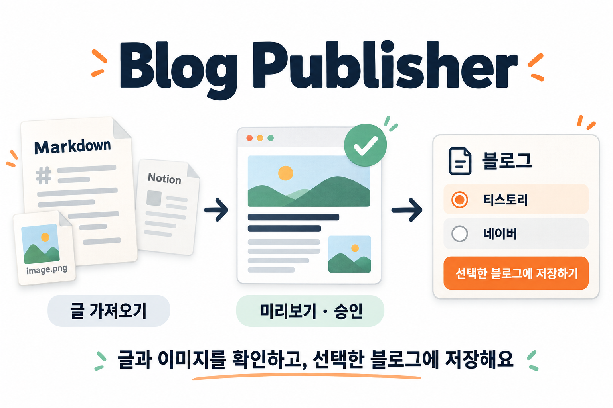

# Blog Publisher

Markdown과 노션 글을 티스토리·네이버 블로그에 올리는 에이전트 스킬입니다.



**글 가져오기 → 미리보기 → 승인 → 블로그에 저장**

로컬 CLI로 실행하며 별도 블로그 MCP 등록은 필요하지 않습니다. 노션 페이지를 직접 읽을 때만 Notion MCP 등 연결 도구를 사용합니다. Markdown과 이미지 파일이 있으면 노션 연결 없이 진행합니다.

## 사용

> 이 Markdown을 티스토리에 비공개로 올려줘. 이미지는 그대로 유지해줘.

> 이 노션 글을 티스토리에 공개로 올려줘. 카테고리는 기술정리로 해줘.

> 티스토리 글을 Markdown으로 내려받아 수정하고 싶어.

로그인은 열린 브라우저에서 직접 진행합니다. 저장 전 제목·본문·카테고리·공개 상태를 확인하고, 저장 후 실제 페이지를 검사합니다.

## 지원 범위

| 기능 | 티스토리 | 네이버 |
|---|---|---|
| Markdown·이미지로 새 글 작성 | 지원 | 지원 |
| 공개·비공개 발행 | 지원 | 지원 |
| 기존 글 다운로드·수정 | 지원 | — |
| 원격 임시저장 | — | 지원 |
| 카테고리 조회 | 지원 | 지원 |
| 카테고리 생성·예약 발행 | 지원 | — |

## 설치

이 저장소를 `blog-publisher` 폴더로 내려받고 해당 폴더에서 실행합니다. Node.js 22 이상이 필요합니다.

```sh
npm ci --ignore-scripts
npx playwright install chromium
```

네이버를 사용하면 [uv](https://docs.astral.sh/uv/getting-started/installation/)와 Python 3.11 이상도 준비합니다.

```sh
npm run setup:naver
```

이 폴더 전체를 사용하는 에이전트의 스킬 경로에 설치하거나 연결합니다. `SKILL.md`뿐 아니라 실행 코드와 의존성도 필요합니다. 브라우저 로그인 창을 열 수 있는 로컬 환경에서 사용합니다.

설치 확인:

```sh
node scripts/blog.mjs help
```

## 파일과 설정

| 환경변수 | 기본값 | 용도 |
|---|---|---|
| `BLOG_WORKSPACE` | `workspace/` | Markdown·이미지 |
| `BLOG_STATE_DIR` | `.state/` | 로그인 세션·백업·미리보기 |
| `BLOG_IMAGE_MAX_WIDTH` | `720` | 티스토리 이미지 표시 너비(px) |
| `BLOG_UV` | `uv` | 네이버 Python 실행용 uv 경로 |

기본 경로는 스킬 폴더 기준입니다. 사용자 지정 경로는 절대 경로를 사용합니다. 이미지 파일은 Markdown과 함께 보관하고 본문에서는 상대 경로로 참조합니다.

`workspace/`와 `.state/`는 Git에서 제외됩니다. 사용자 지정 폴더도 별도로 제외해야 합니다. 로그인 쿠키는 로컬 파일로 저장하므로 세션·백업·원문을 공유하지 않습니다. 저장 여부가 불명확하면 재시도 전에 블로그를 확인합니다.

## 개발

```sh
uv sync --frozen --project engines/naver
npm run check
npm run test:all
BLOG_BROWSER_TEST=1 node --test test/naver-browser.test.js
```

테스트는 실제 블로그에 글을 저장하지 않습니다. 플랫폼 구현은 `src/platforms/`, 공통 변환은 `src/shared/`, CLI는 `scripts/blog.mjs`에 있습니다.

[스킬 지침](SKILL.md) · [명령 안내](references/commands.md)

## 라이선스

[MIT](LICENSE) · [외부 코드 고지](THIRD_PARTY_NOTICES.md)
